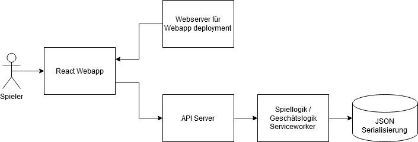
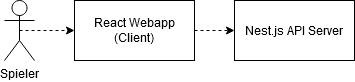
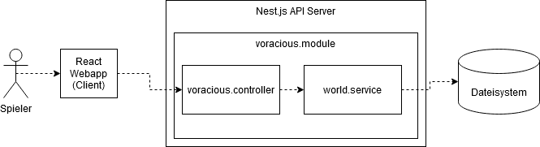
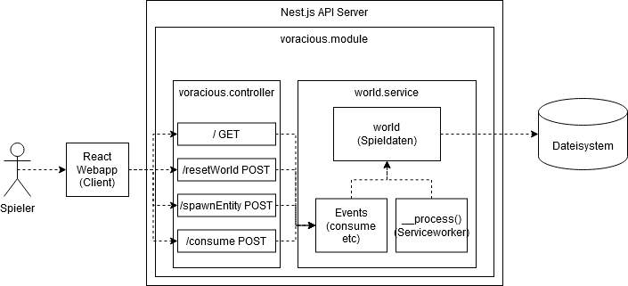
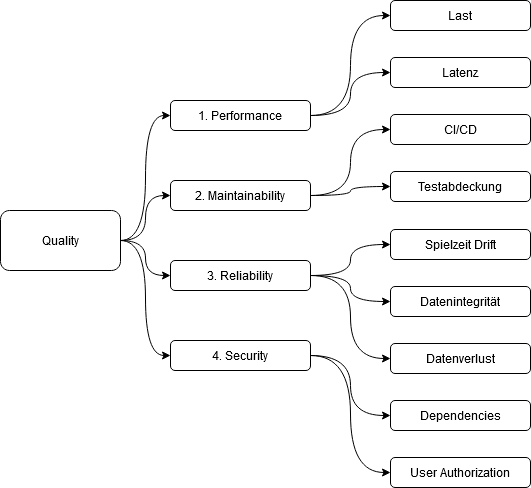

# Einführung und Ziele

## Aufgabenstellung

Es soll ein simples Spiel etabliert werden, bei dem eine beliebige Anzahl Spieler gemeinsam Entitäten in einer geteilten Welt generieren, und einander jagen lassen können. Das Gesamtsystem aus Client und Server soll dabei im groben den Konzepten aus größeren Spieleprojekten nachempfunden sein, und für diese grob Model stehen. 

## Qualitätsziele

| Priorität  | Titel | Beschreibung | Maßstab |
| -- |--| -- | -- |
|1|Laufzeitverhalten - Performance|Das Spiel weißt ein Zeitliches Verhalten auf. Im Server ist ein Service Worker etabliert, welcher die Logik der Spielwelt iteriert. Spieler müssen den aktuellen Stand der Spielwelt live einsehen können.|Für das aktuelle Demonstrationsspiel, muss eine Spielerzahl von 20 Spielern pro Server verlässlich einmal pro Sekunde ein aktuelles Update erhalten, welches zum Zeitpunkt der Darstellung nicht bereits veraltet ist (<1sec Antwortzeit)
|2|Laufzeitverhalten - Drift|Das Verhalten der Spielwelt muss über lange Zeit für Spieler vorraussehbar sein. Wenn ein Spieler nach 1 Stunden wieder einloggt, müssen auch etwa 8 Stunden vergangen sein.| Die Drift darf nicht mehr als 10 Sekunden auf eine Stunde betragen (+-0.278%)
|3|Maintainability|Das System steht Model für ein Early Access Spiel, welches aktiv entwickelt wird, während Spieler aktiv sind. Fixe Abhängigkeiten müssen minimal gehalten sein. Alle Komponenten müssen Modular gestaltet sein. Änderungen finden in der Zukunft vorallem an der Spiellogik statt, weniger an der Kommunikation etc.|Die Testabdeckung ist vorallem für Spielinhalte hoch zu halten.
|4|Reliability|Es handelt sich um ein Spiel. Die Ausfallsicherheit ist kein zentraler Faktor. Es dürfen jedoch im Falle eines Ausfalls keine, oder nur wenige, Spieldaten verloren gehen. Der Spieleserver muss nach einem Ausfall den Spielstand recovern können. |Im Falle eines spontanten Serverausfalls dürfen Spieldaten nicht korruptiert werden, und nicht mehr als 30 Minuten an Aktivität verloren gehen. 

## Stakeholder

| Rolle | Erwartungshaltung |
| -- | -- |
| Architektur Entwickler | Dokumentation der Architektur |
| Gameplay Entwickler | Spiellogik / Geschäftslogik alleinstehend und entkoppelt von Kommunikationslogik etc, CI/CD etabliert zum Testen neuer Spiellogik / Geschäftslogik |
| Testspieler | Gameplay dokumentiert, klare Zielsetzungen für das Testspiel |

# Randbedingungen

| Randbedingung | Beschreibung |
| -- | -- |
| Projektrepository | Das Projekt muss auf Github lokalisiert sein. |
| CI/CD | Es müssen Methoden der Softwarequalitätssicherung automatisiert sein. |
| Sprache | Sowohl Client als auch Server werden in Typescript implementiert. |
| Multiuser System | Mehrere Spieler operieren auf dem gleichen Datensatz |

# Kontextabgrenzung

## Fachlicher Kontext

### API Schnittstellen

| URL | Method | Zweck | Eingabe | Ausgabe |
|--|--|--|--|--|
| / | GET | Dump der gesamten Spieldaten | - | JSON + HTTP-Code |
| /resetWorld | POST | Neustart der Spielwelt | - | HTTP-Code |
| /spawnEntity | POST | Anlegen einer neuen Entity | JSON | HTTP-Code |
| /consume | POST | Anweisung an die Spiellogik den "frisst Entity" Effekt auszulösen | JSON | HTTP-Code |

## Technischer Kontext

| Kontext | Abgrenzung | Schnittstellen |
| -- | -- | -- |
| React Webapp | Webapp, wird im browser des Endnutzers ausgeführt | Grafische Benutzeroberfläche für den Nutzer, Kommunikation mit dem API Server über http requests. Es werden, außer zur Darstellung, keine Daten der Spiellogik vorgehalten. Die Webapp dient nur als thin-client. |
| Webapp deployment | Webserver, wird auf dem Server ausgeführt | Im Produktivbetrieb ein typischer Webserver, welcher die relevanten Daten der Webapp als Webseite zur Verfügung stellt. Während der Entwicklung, Webpack development Server |
| API Server | Nest.js Node Server, wird auf dem selben System wie der Webserver ausgeführt | REST-angelehnte API für den Zugriff auf Spiellogik / Geschäftslogik. Der eigentliche Serviceworker für die Spiellogik ist ein separates Modul, welches im Betrieb von diesem API Server gestartet wird. |
| Spiellogik Serviceworker | Typescript Code, keine spezielle API | Der Serviceworker enthält die Logik des Spiels, in Form einer Main Controll Loop, welche das Prinzip von Spieleengines grob spiegelt. Die Spiellogik wird in regelmäßigen Abständen ausgeführt (üblich sind ~20/sec, in diesem Testprojekt 1/sec). Die tatsächliche Zeit seid dem letzten Frame ("ein Durchlauf der Schleife") wird der Logik übergeben, und ist teil der Berechnungen von Zeitbasierten Effekten. Der Serviceworker enthält zusätzlich die gesamten Daten des Systems aktiv im Speicher, da diese für die Simulation benötigt werden. |
| JSON Serialisierung | persistente Datenhaltung, wird auf dem selben System wie die anderen Server ausgeführt | Es wurde bewusst keine Datenbank für die Geschäftsdaten eingebunden. Es wird nicht nur über die API Schnittstelle auf die Daten selektiv zugegriffen, sondern auch kontinuierlich auf die gesamte Summe der Daten, in Form des Serviceworkers. Stattdessen ist eine JSON Serialisierung der gesammelten Daten auf die Festplatte in regelmäßigen Abständen ausreichend. (Im Fall dieser Testsoftware, jeden Frame. Üblicherweise in regelmäßigen Abständen)

# Lösungsstrategie

## Technologien
| Einsatzzweck | Technologie | Begründung |
|--|--|--|
| API Server | Nest.js auf Node.js | Im Bereich der Typescript Server, ist Node.js nahezu absolut unumgänglich. Nest.js stellt eine der Standardbibliotheken für REST Interfaces, aufbauend auf diesem System, dar und ist gut dokumentiert.|
| Client Interface | React Webapp | Die Software als Webapp im Browser umzusetzen ist Teil der Anforderungen. Die Wahl für React, anstatt beispielsweise Vue o.ä., war pure persönliche Präferenz |

## Architektur
Die Struktur Webapp <-> API-Server <-> Geschäftslogik entspricht in weiten Teilen dem Branchenstandard.
Die Implementierung der Geschäftslogik folgt im groben den Paradigmen in Spieleengines. Die Spieldaten (Geschäftsdaten) bestehen aus einer Reihe von selbstverwaltenden, Baumartig angeordneten Komponenten, welche Event Handler besitzen. Es existiert eine Main-Controll-Loop welche ein Ausführen des nächsten "Frames" durch ein durch den Baum propagierendes "process" event anstößt. Zusätzliche, asynchrone, Events, beispielsweise durch API-Calls, sind ebenfalls erlaubt.

## Qualitätssicherungsmaßnahmen

| Einsatzzweck | Technologie | Begründung |
|--|--|--|
| Unit-tests | Jest | Standard Framework für Tests mit Typescript |
| Integrationstest | Postman | Die Integrität der API wird durch einen Postman Workspace sichergestellt, welcher die API Ausgaben prüft. |
| Integrationstest - Laufzeitverhalten | Diagnoseoutput | Im Serviceworker ist eine Diagnose implementiert, welche die Drift der Spielzeit gegen die Realzeit misst. |
| Statische Analyse | Sonarcube | In der CI/CD Pipeline von github wird Sonarcube angestoßen |
| Security Test | OWASP Dependency Check | Im Projekt genutzte Dependencies werden manuell nach dem hinzufügen von neuen Dependencies mit diesem Tool auf vulnerabilities geprüft. |

# Bausteinsicht

## Ebene 1 - Whitebox Gesamtsystem

Der Spieler interagiert mit einem Clienten im Browser, als Interface für das Spiel. Der Client kommuniziert mit einem zentralen API Server, auf welchem alle Spieldaten zentral hinterlegt sind. Alle Spieler arbeiten damit auf dem gleichen Datensatz, und haben damit Interaktion untereinander. 

| Name | Verantwortung | Schnittstellen | Beschreibung |
| -- | -- | -- | -- |
| Client | Spieler Interface | GUI | Der Client enthält keinerlei Spiellogik, sondern löst ausschließlich events auf dem Server aus. Spieler sehen die Auswirkung ihrer Eingaben erst, nachdem das nächste Mal die Weltdaten vom Server gepolled werden. |
| API Server | Spiellogik + Datenaustausch | REST API | Der API Server bietet nach Außen die Schnittstellen an, mit der die Clienten kommunizieren. Intern enthält er die aktiven Spieldaten, als auch die gesamte Spiellogik. Das System arbeitet nach dem Prinzip, dass der Server die single-source-of-truth ist|

## Ebene 2 

### voracious.module
Nest.js Server sind intern in Module unterteilt. Effektiv können diese als separate Anwendungen, welche vom Server angeboten werden, betrachtet werden. In diesem Fall, gibt es lediglich das Modul "voracious.module". 

### voracious.controller
In dieser Komponente sind die API Schnittstellen, welche nach außen als HTTP Endpoints angeboten werden definiert. Es wird die Schnittstelle nach außen definiert, die DTOs für Eingabe und Ausgabe geparsed und ein Aufruf an die Geschäftslogik ausgeführt. Falls erfordert, werden in dieser Komponente auch Guards und Accesscontroll implementiert.

### world.service
Diese Komponente stellt Spiellogik (Geschäftslogik) zur Verfügung. Sie stellt die Schnittstelle von Nest.js in die äußere Welt dar, und ist nur lose in Nest.js integriert. World.service enthält die eigentlichen Spieldaten, die Spiellogik und den Code für das serialisieren und deserialisieren der Daten auf die Festplatte

## Ebene 3

### voracious.controller
Die einzelnen Endpoints sind separate Methoden innerhalb des Controllers, und werden von Nest.js als Eventhandler für die Verarbeitung von eingehenden http-requests aufgerufen

### world.service - world
Die Spieldaten liegen in Form einer simplen Klassenstruktur vor. Derzeit existieren nur zwei exemplarische Klassen, World und Entity. Es existiert zu jedem Zeitpunkt eine World, welche 0-n Entities enthalten kann.

### world.service - events
Die Spiellogik ist in einer Reihe von Methoden implementiert, welche von außen oder innen aufgerufen werden und die Spieldaten verändern.

### world.service - __process()
Das event __process nimmt eine Sonderrolle ein, da es in regelmäßigen Zeitabständen aufgerufen wird um das zeitliche Verhalten der Spielwelt, in Abhängigkeit der vergangenen Zeit seid dem letzten Aufruf, zu simulieren.
Jede Komponente der Spieldaten (World und Entity) enthält eine separate _process Methode, welche Kaskadierend aufgerufen wird. Die Komponenten beschreiben damit ihr eigenes zeitliches Verhalten. 

# Laufzeitsicht

## Zeitliches Verhalten
Das zeitliche Verhalten erfordert eine spezielle Behandlung durch sowohl den Server, als auch den Client. Im wesentlichen existieren zwei Zyklen.

Der Server führt in regelmäßigem Zeitabstand das __process event der Spiellogik aus. Zusätzlich wird nach diesem Zeitstep der Spieldaten, die Summe der Spieldaten auf das Dateisystem serialisiert.

Server:
1. Startup
2. Spieldaten laden
3. Serviceworker starten (Hier: Javascript Interval)
4. __process(deltatime) start
5. Spieldaten process(deltatime), Zeitstep Veränderung der Spieldaten
6. Spieldaten speichern
7. __process(deltatime) end
8. wait 1000ms
9. goto 4.

Der Client führt in regelmäßigem Zeitabstand (unabhängig vom Server Serviceworker) ein polling der Spieldaten durch, und updated das Interface wo nötig. 

Client:
1. Startup
2. Polling starten
3. / GET
4. Rendere Interface mit Inhalten
5. wait 1000ms (kein Zusammenhang mit 8. von Server)
6. goto 3.

## Spielerinput
Der Client enthält keinerlei Spiellogik. Eingabeelemente werden auf Basis der aktuellen Spieldaten generiert. Eingaben werden als API-Calls an den Server verarbeitet. Alle API-Calls welche Events der Spiellogik darstellen, geben lediglich einen HTTP-Status Code als Antwort. Das Ergebnis der Eingabe wird über das Polling Verhalten wiedergegeben.

Beispiel spawnEntity
1. Client: User gibt Name in Namensfeld ein. Name wird im Interface vorgehalten.
2. Client: User betätigt den Knopf "spawn"
3. Client: API Call "/spawnEntity POST" an Server
4. Server: voracious.controller.spawnEntity(input) executed
5. Server: World.Service.spawnEntity(input) executed
6. Server: Spieldaten sind angepasst
7. unbekannte Wartezeit, bis zum nächsten polling
8. Client: polling / GET
9. Client: Rendere Interface mit Inhalten

## Server Startup

1. Nest.JS Startup, Module laden, dependency injection etc
2. Nest.JS API Endpoints registrieren
3. Prüfe ob Datei mit Spieldaten auf dem Dateisystem existiert
4. Wenn nein, lege sie mit einer leeren Welt an
5. Lade Spieldaten
6. Serviceworker starten
7. DONE

## Server Shutdown

1. Serviceworker stoppen
2. Spieldaten speichern
3. Nest.JS shutdown
4. DONE

# Verteilungssicht

## Development Umgebung

- system: PC des Entwicklers
- **Komponente: React Client**
  - location: localhost:3000, externe_IP:3000
  - Artifacts:
    - Webpack dev-server (Development Server)
  - Verbindung: HTTP-Requests - Nest.JS API Server
- **Komponente: Nest.JS API Server**
  - location: localhost:3001, externe_IP:3001
  - Artifacts:
    - HTTP-Endpoints
    - Spieldaten und Spiellogik

In der Entwicklungsumgebung wird der React Client über den webpack dev-server zur Verfügung gestellt, für continuous integration. Zugriffe finden sowohl von localhost, durch den aktuellen Entwickler, als auch von außerhalb, durch Testspieler, statt.
Aufgrund der unterschiedlichen Ports, muss ein CORS-Header im API-Server konfiguriert werden.

## Produktiv Umgebung
  - system: beliebiger linux server oder docker container
  - **Komponente: Middleware**
    - location: ???
    - Verbindung: Reverse Proxy Webserver
    - Verbindung: Reverse Proxy Nest.JS API Server
  - **Komponente: Webserver**
    - Artifacts:
      - React Client (Static Files)
    - Verbindung: HTTP-Requests - Nest.JS API Server
  - **Komponente: Nest.JS API Server**
    - Artifacts:
      - HTTP-Endpoints
      - Spieldaten und Spiellogik

Im Produktivsystem, wird der Server und der Client als static files in entsprechenden Webservern und Node Servern zur verfügung gestellt. Zusätzlich soll eine Middleware vorgeschaltet werden, welche die Zugriffe auf das Frontend, und die API vereinheitlicht. 

# Querschnittliche Konzepte

## zeitliches Verhalten
Das zeitliche Verhalten betrifft Client und Server zugleich. Der Server verändert Spieldaten über Zeit.

### Update der Spieldaten
Updates der Spieldaten des Servers müssen dem Spieler wiedergegeben werden. Der Einfachheit halber, wird ein Polling Verhalten im Client implementiert, welches die gleiche Update-Rate wie der Serviceworker des Servers hat. 

### Eingabe auf veralteten Spieldaten
Da das Polling des Clienten, und der Serviceworker des Servers gegeneinander phasenverschoben sein können (der Zeitpunkt des updates wird nicht synchornisiert), kann eine Situation eintreten dass ein Spieler eingaben auf veralteten Spieldaten tätigt. Es handelt sich dabei um ein sehr altes Problem von Multiplayerspielen, und ist gemeinhin als "lag" bekannt.
Bis zu einem gewissen Punkt muss dieser Fehler tolleriert werden. Komplett invalide Eingaben (beispielsweise, die Anweisung an eine nicht mehr existierende Entity, eine andere Entity zu fressen) werden jedoch vom Server rejected. Dieser reject ist streng genommen kein Ausnahmefall, sondern wird als normaler Teil der Ausführung behandelt. 

## Datenintegrität
Alle Spieler benötigen eine Repräsentation der gesamten Spielsituation. Um Konflikten bei Änderungen vorzubeugen, wird der Server als single-source-of-truth behandelt. Alle Spieldaten, welche im Speicher der Clienten vorgehalten werden, sind immutable und werden ausschließlich durch Abfrage der entsprechenden API des Servers ausgetauscht.

Konflikte (Beispielsweise, zwei Spieler wollen beide die gleiche Entity fressen lassen) werden damit auf "Eingabe auf veralteten Spieldaten" heruntergebrochen. 

# Qualitätsanforderungen

## Qualitätsbaum

## Qualitätsszenarien

| Name | Gruppe | Beschreibung |
| -- | -- | -- |
| Last | Performance | 20 Spieler pro Server, erhalten verlässlich ein Update pro Sekunde |
| Latenz | Performance | Ein Update der Spieldaten, darf nicht beim Empfangen bereits veraltet sein (Antwortzeit kleiner als Serviceworker rate => 1sec) |
| CI/CD | Maintainability | Updates der Spiellogik und Oberfläche müssen automatisch einer statischen Analyse unterzogen werden |
| CI/CD | Maintainability | Updates der Spiellogik und Oberfläche müssen in der Testumgebung ohne Neustart sichtbar sein. |
| CI/CD | Maintainability |  Änderungen der Architektur und der Kommunikationskomponenten werden seltener geändert. Ein erkennen von groben Programmierfehlern, und ungewolltes Abweichen von etablierten API Definitionen ist ausreichend.  |
| Testabdeckung | Maintainability | Für alle Komponenten der Spiellogik sollen automatische Tests existieren. |
| Testabdeckung | Maintainability | Für alle API Endpunkte müssen automatische Tests existieren. |
| Testabdeckung | Maintainability | Für die immutable Spieldaten im Clienten müssen automatische Tests existieren. |
| Spielzeit Drift | Reliability | Die Drift (differenz zwischen Spielzeit und Echtzeit) darf nicht mehr als 10 Sekunden auf eine Stunde betragen (+- 0.278%) |
| Datenintegrität | Reliability | Die Spieldaten müssen zwischen den einzelnen Clienten identisch sein. Unterschiedliche Anzeigen der aktuellen Spielsituation dürfen niemals länger als einen einzelnen polling-zyklus (1sec) existieren. |
| Datenverlust | Reliability | Die gespeicherten Spieldaten dürfen nicht korrupt werden.  |
| Datenverlust | Reliability | Die gespeicherten Spieldaten dürfen niemals älter als 30 Minuten sein. |
| Dependencies | Security | Es dürfen keine als "Hohes Risiko" markierten Dependencies im Projekt genutzt werden. |
| User Authorization | Security | Es existieren keine personenbezogenen Spielerinformationen. Authentifizierung und Authorisation innerhalb des Systems ist kein Faktor. Es kann im Produktivsystem eine Authorisation über die Middleware vorgeschaltet werden. |

# Risiken und technische Schulden

| Name | Beschreibung |
| -- | -- |
| Floodprotection | Der Server kann prinzipiell mit einer übermässigen Anzahl von "spawnEntity" requests geflutet werden, was die Spieldaten eskaliert, und das gesamte System durch ein hohes Datenvorkommen beim polling ausbremmst. |
| Security Tests | Security Tests müssen in die CI/CD pipeline integriert werden, statt manuell angestoßen zu werden.
| Datenserialisierung im Client | Derzeit wird der Server als trusted source angenommen. Eingehende Daten werden in entsprechende Strukturen gecasted. Auf Client Seite muss hier besser abgesichert werden. muss diese Architektur stringent umgesetzt werden.
| Repository Struktur | Server und Client sind derzeit im selben Repository als Unterordner verortet. In der Rückschau, war das eine schlechte Entscheidung. Es sollte in zwei separate Repos aufgespaltet werden.
| DTO Definitionen | DTO's welche von Client und Server genutzt werden, sind derzeit zweimal definiert. Optimal würden sie in eine extra dependency ausgelagert werden.
| Tick-rate | Der Client und Server arbeiten derzeit beide mit einer sehr niedrigen Tick-rate von 1 Sekunde. Echtzeitspiele arbeiten üblicherweise mit einer Serverrate von 20/sekunde. Viele Performance tests sind mit einer derartig niedrigen Tick-rate quasi nutzlos. Für komplexere Anwendungen, sollte eine höhere Tick-rate getested werden.
| world.service Architektur | Die Konzepte des Komponenten-patterns und Event-driven designs sind in world.service derzeit nicht sauber implementiert. Für ein kleines Demonstrationsprojekt ist es ausreichend, aber wenn ein größeres Projekt auf dieser Basis implementiert werden sollte,

# Glossar {#section-glossary}

| Begriff | Definition |
| -- | -- |
| Client | Die React Webapplikation, welche im Browser des Endnutzers ausgeführt wird. |
| Webserver | Der HTTP Server, welcher den Client zur Verfügung stellt.
| API Server | Der Nest.js Server, welcher die Spieldaten und -logik für die Clients anbietet. 
| Spieldaten | Das, was üblicherweise als Geschäftsdaten bezeichnet wird. Im Kontext dieses Beispiel Spiels, sind damit die Summe aller Daten welche die Spielwelt einer einzelnen Session beschreiben gemeint. |
| Spiellogik | Das, was üblicherweis als Geschäftslogik bezeichnet wird. Im Kontext dieses Beispiel Spiels, handelt es sich um die Events, welche Veränderungen an den Spieldaten bewirken. Sie sind teils als alleinstehende Methoden implementiert, und teils als kaskadierende Events innerhalb der Komponenten der Spieldaten. |
| Serviceworker | Ein scheduler, welcher das __process Event der Spiellogik in regelmäßigen Abständen aufruft, um das zeitliche Verhalten der Spielwelt zu simulieren. 
| zeitliches Verhalten | Es wird eine Spielwelt simuliert, welche sich im Verlauf der Zeit verändert. Entitäten wachsen und werden größer. Das zeitliche Verhalten ist eine Abweichung vom Eingabe -> Verarbeitung -> Ausgabe prinzip des API-Servers. Die Spieldaten verändern sich auch ohne Benutzerinteraktion. 
| Main-Controll-Loop | In Spieleengines wird üblicherweise die gesamte Logik des Spiels in einer alles übergreifenden Schleife implementiert, welche ~60-120 mal pro Sekunde ausgeführt wird. Eingabeverarbeitung, Spiellogik und Rendering werden in dieser Schleife nacheinander abgearbeitet, um ein konsistentes Verhalten zu gewährleisten. Im Kontext dieser Anwendung existiert keine Main-Controll-Loop. Das Verhalten wird durch ein Javascript Interval simuliert. 